# Cub3d 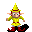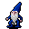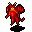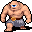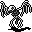

## Developed with [toke5](https://github.com/toke5) 

Cub3d is a Doom-like game that uses raycasting to transform a 2D space into a 3D world. It employs the painter's algorithm to render sprites and items, providing players with various abilities as they navigate through the game.

### Rendering Techniques

- **Billboarding**: All sprites and items use billboarding, which means they always face the player, providing a consistent visual experience.
- **Distance Calculation**: The game calculates the distance of each entity (sprites, items) from the player to determine the rendering order.
- **Sorting / Painters Algotihm**: Entities are sorted based on their distance from the player, ensuring that closer objects are rendered in front of farther ones.

## Features

- **Raycasting Engine**: Converts 2D maps into a 3D first-person perspective.
- **Painter's Algorithm**: Ensures correct rendering order of sprites and items.
- **Billboarding**: All sprites and items are rendered using billboarding, which makes them always face the player.
- **Diverse Items and Guns**: Various items and guns that provide different abilities and weapons to the player.

## Items and Abilities

- **Health Potion**: Restores player's health.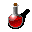
- **Poison Potion**: Decreases player's health.
- **Boots**: Increases player's movement speed.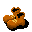
- **Cloak**: Enemies will run away from player.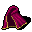
- **Bread**: Restores a small amount of health.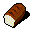
- **Book of Wisdom**: Spawns when all enemies (sprites, spawners, bosses) are defeated, signifying the end of the game.

## Guns

- **Akimbo Pistols**: Standard firearm with moderate damage and range.
- **Minigun**: High rate of fire, but smaller damage.
- **Raygun**: Deals thankful amount of damage, also ability to destroy walls.
- **Crowbar / Wrench**: If theres way to destroy walls we need something to build them also!


## Gameplay

 **Navigate trough the awesome maps defeating various kinds of enemies. Defeat all enemies to spawn the "Book of Wisdom" and complete the game.**

## Maps

## Installation

1. Clone the repository:
 ```bash
    git clone https://github.com/yourusername/cub3d.git
```

## Here are some of the maps included in the game:

### Hell map with demons to be defeated!
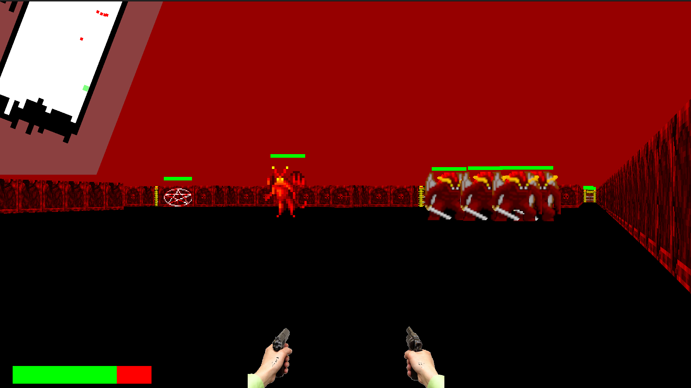

### Blue map with blue boggarts!
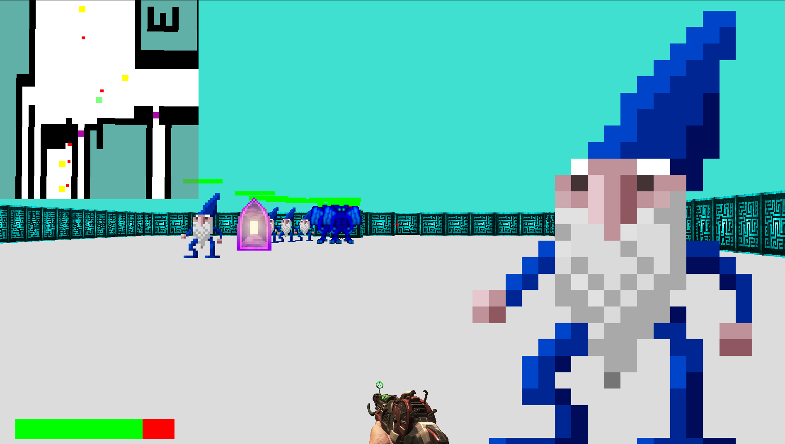

### The first map created with the best sprites boggarts!
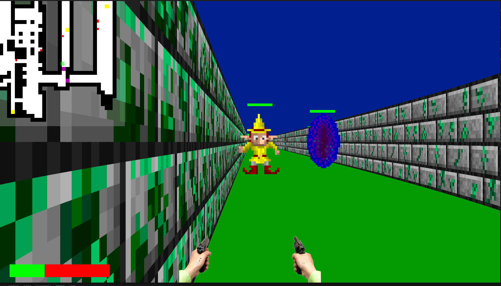

## Diamond map with futuristic enemies !
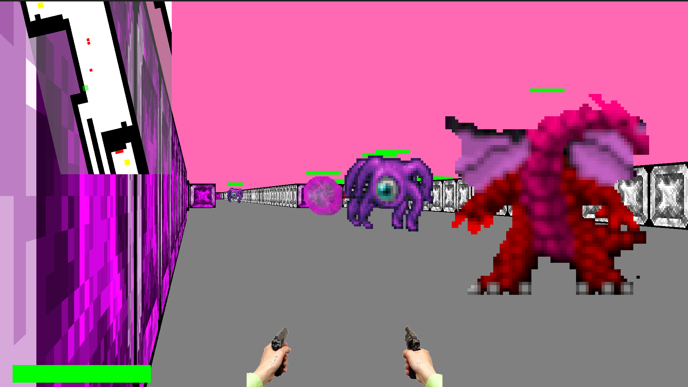

## Bone map with skeletons !
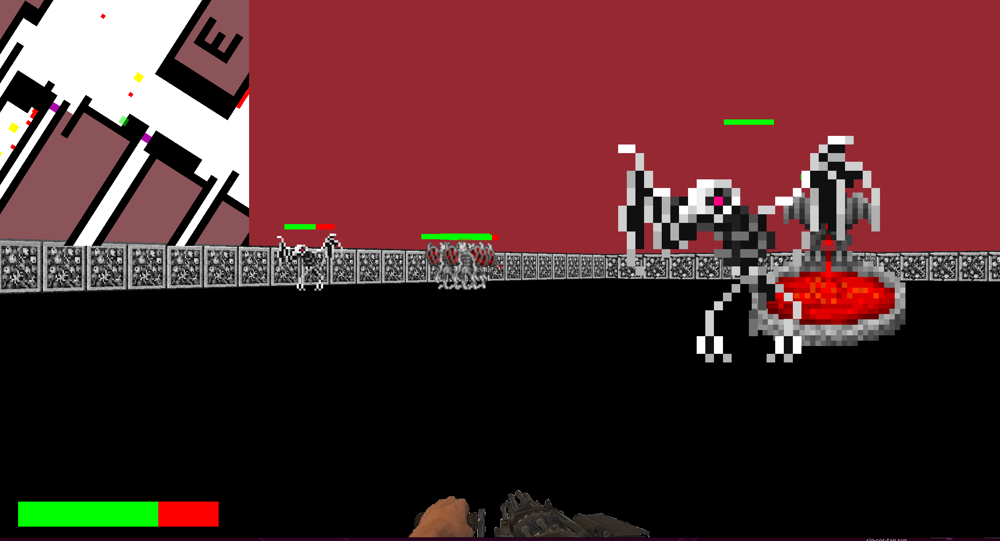

### Flesh map with cyclop giants!
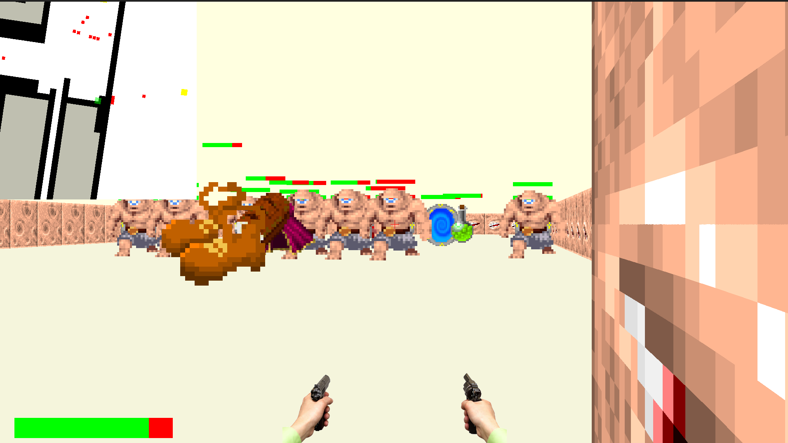

